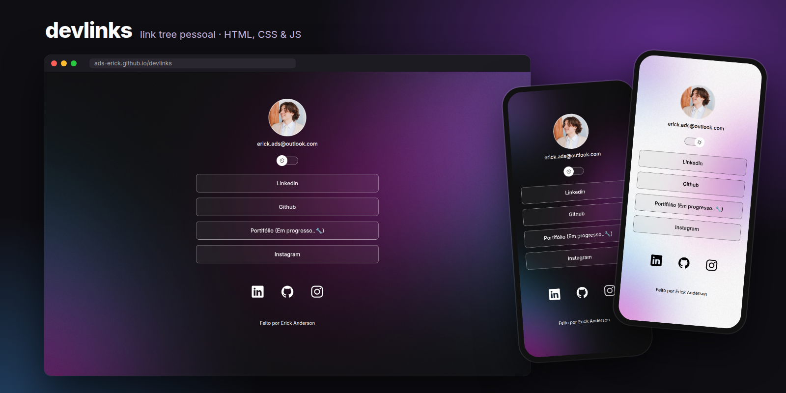
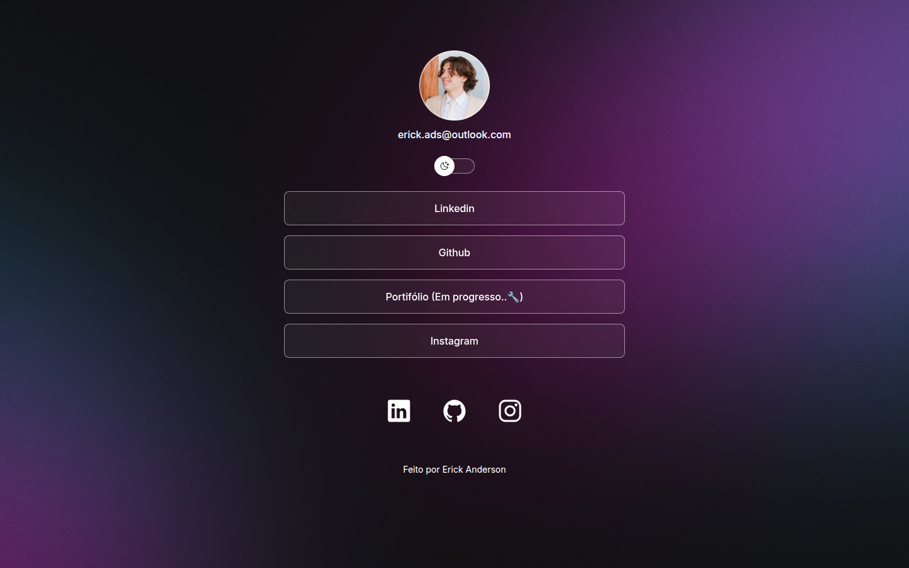
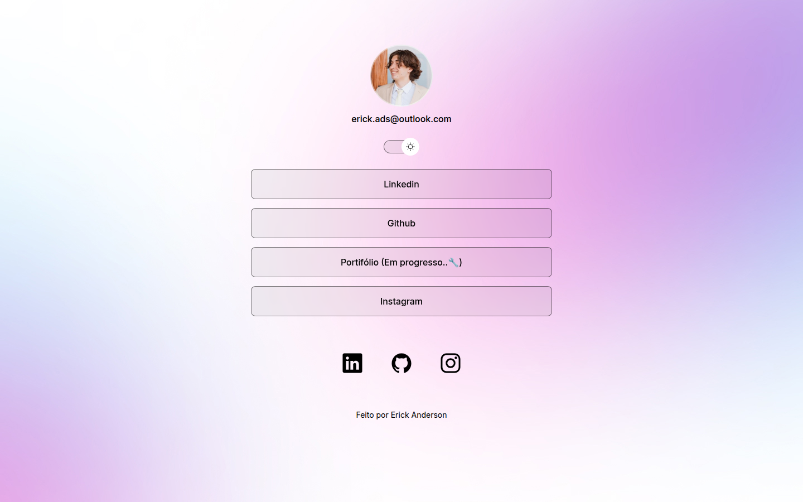
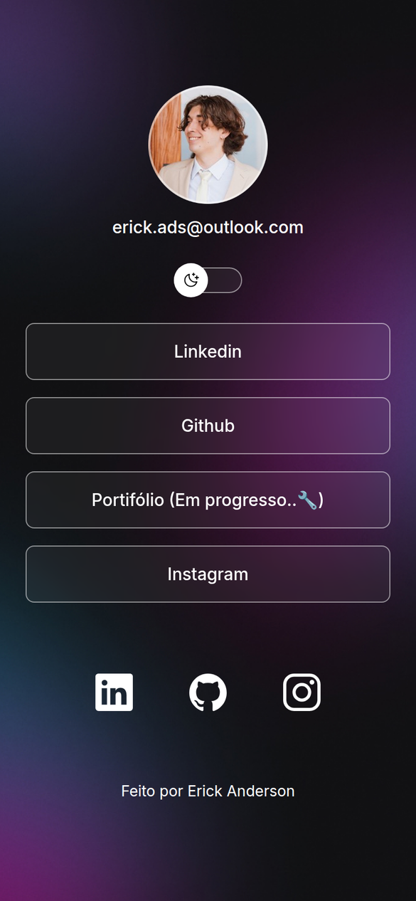
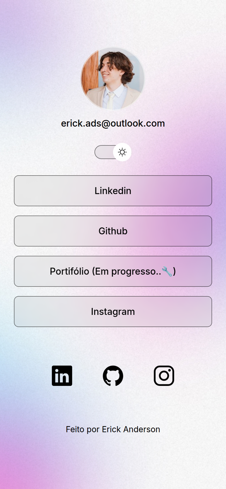

<h1 align="center">devlinks</h1>

<p align="center">
  Agregador de links pessoal — uma <i>link tree</i> feita do zero para centralizar minhas redes sociais e portfólio.
</p>

<p align="center">
  <a href="https://ads-erick.github.io/devlinks/"><strong>🔗 Acessar o projeto</strong></a>
</p>

<p align="center">
  
  
  
  
</p>

<p align="center">
  
</p>

---

## ✨ Funcionalidades

- **Modo claro / escuro** — um switch alterna o tema adicionando a classe `light` no `<html>`; cores, fundo e ícone do botão mudam via variáveis CSS, com animação no deslize.
- **Responsivo** — layout pensado primeiro para o celular, com imagens de fundo diferentes para mobile e desktop (media queries).
- **Links principais** — botões com efeito de vidro (`backdrop-filter`) e hover destacado.
- **Redes sociais** — ícones do [Ionicons](https://ionic.io/ionicons) para LinkedIn, GitHub e Instagram.

## 📸 Screenshots

### Desktop

| Modo escuro | Modo claro |
| :---: | :---: |
|  |  |

### Mobile

| Modo escuro | Modo claro |
| :---: | :---: |
|  |  |

## 🛠️ Tecnologias

| Tecnologia | Uso |
| --- | --- |
| **HTML** | Estrutura e semântica da página |
| **CSS** | Variáveis (custom properties), Flexbox, `backdrop-filter`, media queries e animações com `@keyframes` |
| **JavaScript** | Manipulação do DOM para alternar o tema |
| **Git / GitHub Pages** | Versionamento e hospedagem |

## 📁 Estrutura

```
devlinks/
├── index.html      # estrutura da página
├── style.css       # estilos, temas e responsividade
├── script.js       # alternância de tema (toggleMode)
└── assets/         # avatar, fundos, ícones do switch e imagens do README
```

## 🚀 Rodando localmente

Não precisa de build nem dependências — é só clonar e abrir o `index.html`:

```bash
git clone https://github.com/ads-erick/devlinks.git
cd devlinks
xdg-open index.html   # ou simplesmente abra o arquivo no navegador
```

---

<p align="center">
  Feito por <a href="https://github.com/ads-erick">Erick Anderson</a> ·
  <a href="https://www.linkedin.com/in/erick-anderson-dos-santos-6a9929352/">LinkedIn</a>
</p>
